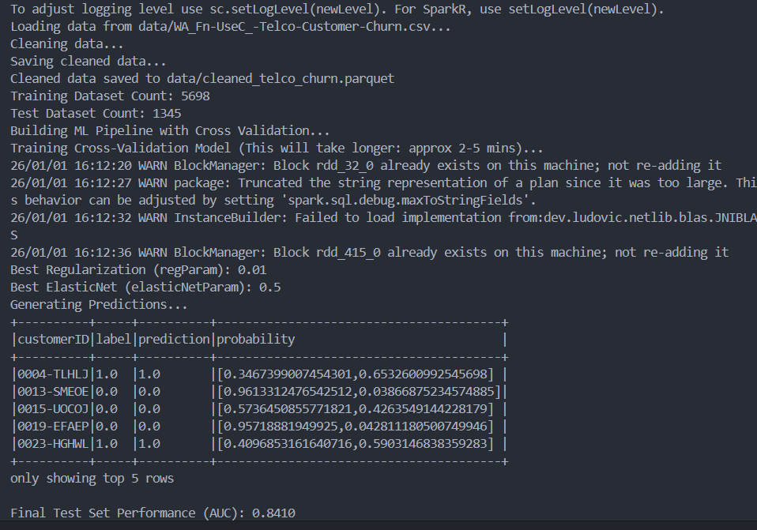
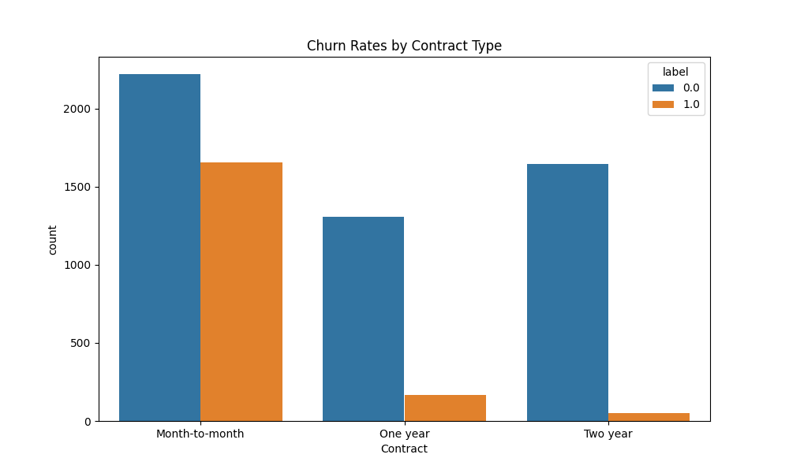

# Customer Churn Prediction Pipeline with PySpark

<div align="center">


</div>

A **production-grade, distributed machine learning pipeline** for predicting customer churn using **Apache Spark (PySpark)**.  
This project demonstrates **modular software engineering**, **robust ETL**, and **hyperparameter optimization** using cross-validation at scale.

---

## 📌 Project Overview

Customer churn is a critical KPI for subscription-based businesses.  
This application processes the **Telco Customer Churn dataset** to identify at-risk customers using a scalable Spark-based ML pipeline.

### Key Technical Features

- **Distributed Computing**  
  Built entirely on **PySpark** for horizontal scalability.

- **Modular Architecture**  
  Clear separation of concerns:
  - ETL
  - Feature Engineering
  - Model Training
  - Configuration

- **Robust ETL**
  - Explicit schema enforcement
  - Handles type casting errors (`TotalCharges`)
  - Null imputation strategies

- **Advanced ML Pipeline**
  - `StringIndexer`
  - `OneHotEncoder`
  - `VectorAssembler`
  - `StandardScaler`

- **Mathematical Optimization**
  - `CrossValidator`
  - `ParamGridBuilder`
  - Grid search over Regularization and ElasticNet parameters

---

## 📂 Repository Structure

```plaintext
churn_spark_pipeline/
├── data/
│   ├── WA_Fn-UseC_-Telco-Customer-Churn.csv  # Raw input dataset
│   └── cleaned_telco_churn.parquet/          # Processed output (Parquet)
├── src/
│   ├── __init__.py
│   ├── config.py           # Centralized configuration (paths, schema, constants)
│   ├── data_cleaning.py    # ETL logic (schema enforcement, imputation)
│   └── model_pipeline.py   # ML pipeline (feature engineering, grid search)
├── notebooks/
│   └── EDA_Analysis.ipynb  # Exploratory data analysis & business insights
├── main.py                 # Application entry point
├── requirements.txt        # Python dependencies
└── README.md               # Project documentation
```

## 🛠️ Installation & Setup
**Prerequisites**
  - Python: 3.10 or 3.11
  - Python 3.13 is not compatible with PySpark 3.4
  - Java: 11 (required for Spark JVM backend)

1. Clone Repository & Create Virtual Environment
```
git clone https://github.com/YOUR_USERNAME/churn_spark_pipeline.git

cd churn_spark_pipeline
```
```
python -m venv .venv
source .venv/bin/activate      # Linux / macOS
# .venv\Scripts\activate       # Windows
```

2. Install Dependencies
```
pip install -r requirements.txt
```
3. Windows-Specific Configuration
If running locally on Windows, ensure:

`winutils.exe`

`hadoop.dll`

are available and properly configured in `%HADOOP_HOME%`.

Refer to the Troubleshooting section if Spark fails to initialize.

## 🚀 Usage
Run the full end-to-end pipeline:
```
python main.py
```
### Pipeline Workflow
1. Data Ingestion

    - Reads CSV with enforced schema

2. Data Cleaning

    - Casts `TotalCharges` to `Double`

    - Handles whitespace and invalid values

    - Imputes missing values

3. Train/Test Split

    - Stratified split: 80% Train / 20% Test

4. Model Tuning

    - Logistic Regression

    - 3-Fold Cross-Validation

    - Grid search over:

        - `regParam`

        - `elasticNetParam`

5. Evaluation

    - Computes AUC

    - Saves predictions to `output/`

## 📊 Model Performance
The pipeline automatically selects optimal hyperparameters.

### Typical Results (Test Set):

| Metric                 | Value                            |
| ---------------------- | -------------------------------- |
| Algorithm              | Logistic Regression (ElasticNet) |
| Best `regParam`        | 0.01                             |
| Best `elasticNetParam` | 0.5                              |
| AUC Score              | **0.8410**                       |

> **Execution Output:**
> 

## 📈 Exploratory Data Analysis (EDA)
Detailed visual analysis is available in:

```
notebooks/EDA_Analysis.ipynb
```
EDA is performed using **PySpark aggregations**, with visualizations created via **seaborn** and **matplotlib**.

**Key Insight: Contract Type vs Churn**
Customers with "Month-to-month" contracts show a drastically higher churn rate compared to one or two-year contracts, suggesting a focus area for retention teams.



### Key Business Insights
  
  - Month-to-month contracts have significantly higher churn

  - Fiber Optic users churn more than DSL users

  - Electronic Check payment method is strongly correlated with churn

## 📌 Notes
Designed for local Spark execution and cluster deployment

Uses Parquet for efficient storage and downstream scalability

Codebase follows production-style organization rather than notebook-driven workflows

## 📄 License
This project is intended for educational and demonstration purposes.